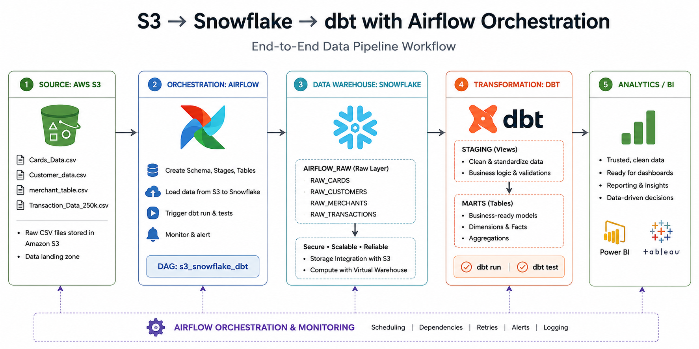

# 🚀 Airflow & dbt Banking Pipeline Platform + dbt Deep Knowledge Master Guide

> **A Comprehensive Reference Guide for Data Engineers & Analytics Engineers**  
> *Covering Architecture, Directory Structure, File Explanations, Core Mechanics, Materializations, Jinja Macros, CLI Commands, Node Selection Syntax, and Top Interview Questions.*

---
## Workflow



## 📌 Table of Contents
1. [What is dbt & Why Do We Use It?](#1-what-is-dbt--why-do-we-use-it)
2. [dbt Architecture & How It Works Under the Hood](#2-dbt-architecture--how-it-works-under-the-hood)
3. [dbt Project File & Directory Structure](#3-dbt-project-file--directory-structure)
   - [Complete Directory Tree](#complete-directory-tree)
   - [Detailed Breakdown of Every File & Directory](#detailed-breakdown-of-every-file--directory)
4. [`dbt_project.yml` vs `sources.yml` vs `schema.yml`](#4-dbt_projectyml-vs-sourcesyml-vs-schemayml)
5. [Core Concepts & Mechanics](#5-core-concepts--mechanics)
   - [`ref()` vs `source()` Functions](#ref-vs-source-functions)
   - [Materialization Types & Strategies (Deep Dive)](#materialization-types--strategies-deep-dive)
   - [dbt Testing Framework](#dbt-testing-framework)
   - [dbt Snapshots (SCD Type 2)](#dbt-snapshots-scd-type-2)
   - [Jinja & Macros](#jinja--macros)
   - [Hooks & Operations](#hooks--operations)
6. [Essential dbt CLI Commands & Graph Selectors](#6-essential-dbt-cli-commands--graph-selectors)


---

## 1. What is dbt & Why Do We Use It?

**dbt (data build tool)** is a transformation workflow tool that allows data teams to inspect, transform, test, and document data inside cloud data warehouses using SQL and software engineering best practices (version control, CI/CD, modularity, testing, documentation).

### Key Characteristics:
* **The "T" in ELT**: dbt does **not** extract or load raw data into your warehouse. Data is extracted and loaded first (e.g., via Airflow, Fivetran, Stitch, Airbyte), and dbt operates **inside** the data warehouse to transform raw tables into analytics-ready data marts.
* **Pushdown Execution**: dbt compiles Jinja-flavored SQL into raw SQL and pushes the computation directly down to target cloud data warehouses (Snowflake, BigQuery, Databricks, Redshift, PostgreSQL).
* **Software Engineering Principles in Data**:
  * **DRY (Don't Repeat Yourself)**: Use Jinja macros and reusable views/tables.
  * **Version Control**: Git-integrated workflow for data transformations.
  * **Data Quality Testing**: Automated assertion checks on outputs.
  * **Automated Lineage & Documentation**: Auto-generated DAGs and data catalogs.

---

## 2. dbt Architecture & How It Works Under the Hood

```
   Raw Data Sources (S3, Postgres, APIs)
                     │
                     ▼ (Loaded via Airflow / Copy Into)
        ┌─────────────────────────┐
        │  Data Warehouse (RAW)   │
        └────────────┬────────────┘
                     │
         ┌───────────┴───────────┐
         │     dbt Execution     │
         │  (Compiles & Executes)│
         └───────────┬───────────┘
                     │
      ┌──────────────┼──────────────┐
      ▼              ▼              ▼
   Staging        Marts          Data Docs
  (Views)        (Tables)       & Catalog
```

### Execution Pipeline (Step-by-Step):
1. **Parsing**: dbt reads `dbt_project.yml`, `profiles.yml`, and all `.sql` and `.yml` files.
2. **DAG Construction**: dbt analyzes `ref()` and `source()` statements to build a **Directed Acyclic Graph (DAG)** of data dependencies.
3. **Compilation**: Jinja templates, macros, and environment variables are compiled into pure, dialect-specific SQL scripts inside the `/target/compiled/` directory.
4. **Target Execution**: dbt wraps compiled SQL into DDL/DML statements (`CREATE VIEW`, `CREATE TABLE AS`, `MERGE INTO`, `DELETE + INSERT`) and executes them against the target data warehouse connection defined in `profiles.yml`.
5. **Artifact Generation**: Outputs execution metrics into JSON artifacts (`manifest.json`, `run_results.json`, `catalog.json`).

---

## 3. dbt Project File & Directory Structure

### Complete Directory Tree

```text
banking_dbt/
├── dbt_project.yml         # Main project configuration file
├── profiles.yml            # Data warehouse connection credentials (or in ~/.dbt/)
├── packages.yml            # External dbt package dependencies (optional)
├── analyses/               # Ad-hoc SQL queries compiled by dbt without creating DB objects
│   └── customer_insights.sql
├── macros/                 # Custom reusable Jinja macros & custom materializations
│   ├── cents_to_dollars.sql
│   └── generate_schema_name.sql
├── models/                 # Core SQL transformation logic
│   ├── sources.yml         # Definition & freshness tests for raw upstream tables
│   ├── staging/            # Staging layer (cleaning, casting, renaming)
│   │   ├── _staging_models.yml
│   │   ├── stg_cards.sql
│   │   ├── stg_customers.sql
│   │   ├── stg_merchants.sql
│   │   └── stg_transactions.sql
│   └── marts/              # Business analytics layer (dimensions & facts)
│       ├── _marts_models.yml
│       ├── dim_customers.sql
│       ├── dim_merchants.sql
│       └── fct_transactions.sql
├── seeds/                  # Static CSV lookup files loaded directly to warehouse
│   ├── country_codes.csv
│   └── seed_properties.yml
├── snapshots/              # Historical change tracking (SCD Type 2)
│   └── customer_status_snapshot.sql
├── tests/                  # Custom singular SQL data tests
│   └── assert_positive_transaction_amount.sql
├── target/                 # Compiled SQL and dbt artifacts (auto-generated)
│   ├── compiled/
│   ├── run/
│   ├── manifest.json
│   ├── run_results.json
│   └── catalog.json
└── logs/                   # Raw dbt execution logs
    └── dbt.log
```

---

### Detailed Breakdown of Every File & Directory

#### 1. `dbt_project.yml` (Mandatory Root File)
The configuration heart of a dbt project. Defines project name, version, profile link, model directory paths, target cleanup lists, and hierarchical model configurations.

```yaml
name: 'banking_dbt'
version: '1.0.0'
config-version: 2

# Links this project to a profile in profiles.yml
profile: 'banking_dbt'

model-paths: ["models"]
analysis-paths: ["analyses"]
test-paths: ["tests"]
seed-paths: ["seeds"]
macro-paths: ["macros"]
snapshot-paths: ["snapshots"]

target-path: "target"
clean-targets:
  - "target"
  - "dbt_packages"

# Global configurations applied to model subfolders
models:
  banking_dbt:
    staging:
      +materialized: view
      +schema: STAGING
    marts:
      +materialized: table
      +schema: CURATED
```

#### 2. `profiles.yml` (Connection Setup)
Contains database credentials and connection parameters per environment (dev, staging, prod). Kept separate or git-ignored for security.

```yaml
banking_dbt:
  target: dev
  outputs:
    dev:
      type: snowflake
      account: "xy12345.us-east-1"
      user: "AIRFLOW_USER"
      password: "{{ env_var('DBT_ENV_SECRET_PASSWORD') }}"
      role: "TRANSFORMER"
      database: "BANKING_DB"
      warehouse: "COMPUTE_WH"
      schema: "DEV_CURATED"
      threads: 4
      client_session_keep_alive: false
    prod:
      type: snowflake
      account: "xy12345.us-east-1"
      user: "PROD_DBT_USER"
      password: "{{ env_var('PROD_DBT_PASSWORD') }}"
      role: "PROD_TRANSFORMER"
      database: "BANKING_DB"
      warehouse: "PROD_WH"
      schema: "CURATED"
      threads: 8
```

#### 3. `sources.yml` (Upstream Source Declarations)
Declares raw database tables created outside dbt (e.g. ingested via Airflow/Kafka/S3). Enables `source('source_name', 'table_name')` referencing and source freshness monitoring.

```yaml
version: 2

sources:
  - name: airflow_raw
    database: BANKING_DB
    schema: AIRFLOW_RAW
    description: "Raw relational data ingested from S3 staging buckets."
    freshness:
      warn_after: {count: 12, period: hour}
      error_after: {count: 24, period: hour}
    loaded_at_field: _loaded_at
    tables:
      - name: raw_cards
        description: "Raw customer credit/debit cards data."
      - name: raw_customers
        description: "Raw bank customer demographics."
      - name: raw_transactions
        description: "Raw transactional ledger entries."
```

#### 4. `schema.yml` / `_models.yml` (Model Documentation & Generic Tests)
Defines metadata, column documentation, and generic data tests (`unique`, `not_null`, `accepted_values`, `relationships`) for models.

```yaml
version: 2

models:
  - name: stg_customers
    description: "Cleaned customer records from raw_customers."
    columns:
      - name: customer_id
        description: "Primary key for customer entity."
        tests:
          - unique
          - not_null
      - name: customer_segment
        description: "Customer tier classification."
        tests:
          - accepted_values:
              values: ['RETAIL', 'CORPORATE', 'VIP', 'HNW']

  - name: fct_transactions
    description: "Fact table containing financial transactions."
    columns:
      - name: transaction_id
        tests:
          - unique
          - not_null
      - name: customer_id
        tests:
          - relationships:
              to: ref('dim_customers')
              field: customer_id
```

#### 5. `packages.yml` (External Package Dependencies)
Used to import third-party dbt packages (e.g., `dbt-labs/dbt_utils`, `calogica/dbt_expectations`).

```yaml
packages:
  - package: dbt-labs/dbt_utils
    version: 1.1.1
  - package: calogica/dbt_expectations
    version: 0.10.1
```

#### 6. `models/` Directory
The core code location containing `.sql` transformation queries organized by architectural layer:
* **Staging Layer (`staging/`)**: Light transformations on raw sources (renaming columns, type casting, filtering invalid records). Usually materialized as `view`.
* **Intermediate Layer (`intermediate/`)**: Complex joins, windowing, or aggregations shared between multiple marts.
* **Marts Layer (`marts/`)**: Business-facing Dimension (`dim_`) and Fact (`fct_`) models optimized for BI tools and dashboards. Usually materialized as `table` or `incremental`.

#### 7. `macros/` Directory
Contains reusable SQL helper functions and custom materializations written in Jinja.
Example (`cents_to_dollars.sql`):
```sql

    round( cast({{ column_name }} as numeric) / 100, {{ scale }} )

```

#### 8. `seeds/` Directory
Holds static lookup CSV files (e.g., ZIP code mapping, state codes). Executing `dbt seed` builds physical tables in the database from these CSVs.

#### 9. `snapshots/` Directory
Implements Slowly Changing Dimensions (SCD Type 2) to capture historical changes over time in source tables.

#### 10. `analyses/` Directory
Contains SQL queries that use Jinja/`ref()`, compiled by dbt into valid SQL under `target/compiled/`, but **never executed** or created as database objects. Useful for ad-hoc validation or BI queries.

#### 11. `tests/` Directory
Contains custom **singular tests** (SQL queries asserting business rules). If the query returns **zero rows**, the test passes. If it returns 1 or more rows, the test fails.

---

## 4. `dbt_project.yml` vs `sources.yml` vs `schema.yml`

| Feature / Aspect | `dbt_project.yml` | `sources.yml` | `schema.yml` |
| :--- | :--- | :--- | :--- |
| **Primary Scope** | Project-level configuration & settings. | Upstream raw source tables (outside dbt). | Model documentation & data quality assertions. |
| **File Location** | Root directory of dbt project. | Inside `models/` subdirectories. | Inside `models/` subdirectories. |
| **Key Declarations** | Materializations, schemas, macro paths, variables, tags. | External tables, source freshness thresholds, database/schema names. | Column definitions, descriptions, generic tests (`unique`, `not_null`). |
| **Reference Method** | N/A (Project configuration file). | Referenced via `source('source_name', 'table_name')`. | Configures models referenced via `ref('model_name')`. |
| **Multiplicity** | Exactly **ONE** file per dbt project. | Multiple files allowed across `models/`. | Multiple files allowed across `models/`. |

---

## 5. Core Concepts & Mechanics

### `ref()` vs `source()` Functions

* **`source('source_name', 'table_name')`**:
  * Points to raw tables ingested into the data warehouse outside of dbt's control.
  * Tells dbt: *"This is an external starting point. Build DAG lineage from this source."*
  * Example: `FROM {{ source('airflow_raw', 'raw_transactions') }}`

* **`ref('model_name')`**:
  * Points to another dbt model built within the current project.
  * Performs **two critical tasks**:
    1. **Dependency Resolution**: Informs dbt of execution order (build parent model before child model).
    2. **Environment Parameterization**: Replaces model name with full target database schema environment path (`"BANKING_DB"."CURATED"."dim_customers"` vs `"DEV_CURATED"."dim_customers"`).
  * Example: `FROM {{ ref('stg_customers') }}`

---

### Materialization Types & Strategies (Deep Dive)

dbt supports four primary materialization types:

```
                  ┌─────────────────────────────────────────┐
                  │          dbt Materializations           │
                  └────────────────────┬────────────────────┘
                                       │
         ┌─────────────────┬───────────┴─────┬──────────────────┐
         ▼                 ▼                 ▼                  ▼
       View              Table          Incremental         Ephemeral
   (Virtual View)   (Drop & Create)    (Insert/Merge)      (Inlined CTE)
```

#### 1. `view` (Default)
* **How it works**: Compiles SQL into a standard database view (`CREATE OR REPLACE VIEW schema.model AS ...`).
* **Pros**: No data storage required; always shows latest underlying source data.
* **Cons**: Slow query performance if underlying transformation is computationally expensive.

#### 2. `table`
* **How it works**: Drops existing table and recreates physical table (`CREATE TABLE schema.model AS SELECT ...`).
* **Pros**: Fast read queries for end users & BI tools.
* **Cons**: Long build times for large datasets; temporary data unavailability during drop/recreate step.

#### 3. `incremental`
* **How it works**: Builds the table as physical storage on first run (`CREATE TABLE`). On subsequent runs, it only processes rows created or modified since the last execution.
* **Jinja Macro Logic**:
  ```sql
  {{
      config(
          materialized='incremental',
          unique_key='transaction_id',
          incremental_strategy='merge'
      )
  }}

  SELECT
      transaction_id,
      customer_id,
      transaction_amount,
      updated_at
  FROM {{ ref('stg_transactions') }}

  
      -- Filter to process only rows newer than max existing date in target table
      WHERE updated_at > (SELECT MAX(updated_at) FROM {{ this }})
  
  ```
* **Incremental Strategies**:
  * **`merge`** (Snowflake / BigQuery default): Performs an atomic `MERGE INTO` statement using `unique_key` to `UPDATE` matching existing records and `INSERT` new ones.
  * **`append`**: Directly appends new rows (`INSERT INTO`). Fastest, but allows duplicate records if non-unique.
  * **`delete+insert`**: Deletes existing records matching `unique_key` or partition, then inserts new rows.
  * **`insert_overwrite`** (BigQuery / Databricks): Overwrites entire partitions containing updated records.

#### 4. `ephemeral`
* **How it works**: Does **not** create any table or view in the database. Interpolates the model's code as a Common Table Expression (CTE) directly inside downstream queries referencing it (`WITH model_name AS (...)`).
* **Pros**: Zero storage, zero database DDL operations, keeps warehouse clean.
* **Cons**: Cannot perform direct data quality tests or inspect intermediary results in database.

---

### dbt Testing Framework

Data tests in dbt are assertions written as SELECT statements expecting 0 failing rows.

#### Generic Tests (Out of the Box)
Declared in YAML (`schema.yml`):
1. **`unique`**: Verifies column values are unique.
2. **`not_null`**: Verifies no NULL values exist.
3. **`accepted_values`**: Verifies column values belong to an allowed set.
4. **`relationships`**: Verifies referential integrity (foreign key exists in parent model).

#### Singular Tests (Custom SQL)
Written as `.sql` files in `tests/`. Example (`assert_positive_transaction_amount.sql`):
```sql
-- Fails if any transaction amount is zero or negative
SELECT
    transaction_id,
    transaction_amount
FROM {{ ref('fct_transactions') }}
WHERE transaction_amount <= 0
```

---

### dbt Snapshots (SCD Type 2)

dbt Snapshots track changes over time in mutable tables by maintaining record validities (`dbt_valid_from`, `dbt_valid_to`).

```sql


{{
    config(
      target_schema='snapshots',
      unique_key='customer_id',
      strategy='timestamp',
      updated_at='updated_at'
    )
}}

SELECT * FROM {{ source('airflow_raw', 'raw_customers') }}


```

#### Snapshot Strategies:
1. **`timestamp` Strategy**: Relies on an `updated_at` column in source table to detect changes.
2. **`check` Strategy**: Used when source table lacks an updated timestamp. Monitors specified columns for state changes (e.g. `check_cols=['status', 'address', 'income']`).

---

### Jinja & Macros

dbt uses **Jinja2** templating to make SQL dynamic and programmatic.

* **Expressions**: `{{ ... }}` (Outputs compiled SQL values).
* **Control Statements**: `` (Executes logic, loops, conditionals).
* **Comments**: `{# ... #}`.

#### Example Macro (`macros/grant_select.sql`):
```sql

    
        GRANT USAGE ON SCHEMA {{ schema_name }} TO ROLE {{ role_name }};
        GRANT SELECT ON ALL TABLES IN SCHEMA {{ schema_name }} TO ROLE {{ role_name }};
    

    
    {{ log("Granted select privileges on " ~ schema_name ~ " to " ~ role_name, info=True) }}

```

---

### Hooks & Operations

Hooks allow executing custom SQL at specific execution lifecycle events:
* `pre-hook`: Executed **before** model SQL runs (e.g., setting session variables or audit logs).
* `post-hook`: Executed **after** model builds successfully (e.g., granting table permissions).
* `on-run-start`: Executed at start of `dbt run`.
* `on-run-end`: Executed after completion of `dbt run`.

```sql
{{
  config(
    materialized='table',
    post_hook="GRANT SELECT ON {{ this }} TO ROLE analytics_reader"
  )
}}
```

---

## 6. Essential dbt CLI Commands & Graph Selectors

### Core Execution Commands

```bash
# Verify connection to target warehouse
dbt debug

# Install external package dependencies from packages.yml
dbt deps

# Execute seeds (upload CSVs to target warehouse)
dbt seed

# Run all models in project
dbt run

# Run all tests
dbt test

# Build all models, seeds, snapshots, and tests in DAG order
dbt build

# Run SCD Type 2 snapshots
dbt snapshot

# Generate documentation artifacts & launch local docs server
dbt docs generate
dbt docs serve --port 8080

# Clean compiled target directory
dbt clean
```

---

### Node Selection Syntax (`--select` / `-s` & `--exclude`)

dbt graph operators allow precise selection of execution subsets:

| Command Selector | Description |
| :--- | :--- |
| `dbt run --select stg_customers` | Executes **only** `stg_customers`. |
| `dbt run --select +stg_customers` | Executes `stg_customers` and **all upstream parent models**. |
| `dbt run --select stg_customers+` | Executes `stg_customers` and **all downstream child models**. |
| `dbt run --select +stg_customers+` | Executes `stg_customers`, **all parents**, and **all children**. |
| `dbt run --select @stg_customers` | Executes `stg_customers`, parents, children, and **parents of children**. |
| `dbt run --select path:models/staging` | Executes all models inside the `models/staging` directory. |
| `dbt run --select tag:daily` | Executes all models tagged with `daily`. |
| `dbt run --select config.materialized:incremental` | Executes all models materialized as `incremental`. |
| `dbt run --select +fct_transactions --exclude stg_cards` | Runs `fct_transactions` and parents, **excluding** `stg_cards`. |
| `dbt run --select state:modified+ --state ./path/to/artifacts` | **Slim CI**: Runs only models modified since last state baseline + downstream dependencies. |

---


## 🛠️ Summary Cheat Sheet

| Task | dbt Command |
| :--- | :--- |
| **Verify setup** | `dbt debug` |
| **Install packages** | `dbt deps` |
| **Load CSV lookup data** | `dbt seed` |
| **Run all models** | `dbt run` |
| **Run data quality tests** | `dbt test` |
| **Build DAG (Seed + Run + Test)** | `dbt build` |
| **Run SCD Type 2 Snapshots** | `dbt snapshot` |
| **Run modified nodes only (Slim CI)** | `dbt build --select state:modified+ --state ./artifacts` |
| **Generate & view documentation** | `dbt docs generate && dbt docs serve` |

---
*Created for interview preparation and production dbt workflow mastery.*
